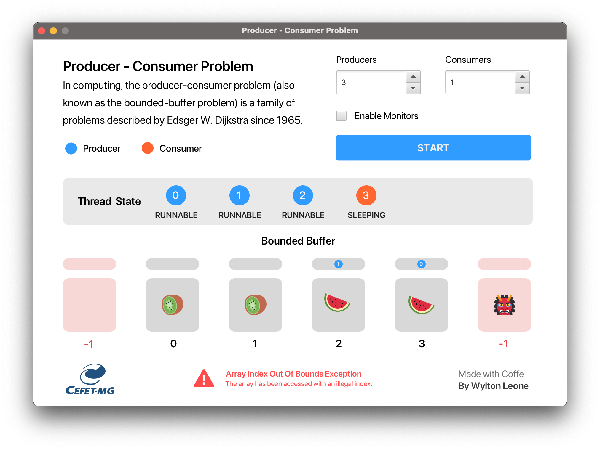
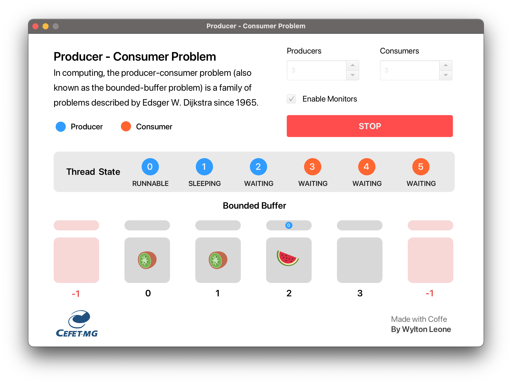

<b>In computing, the producer-consumer problem (also known as the bounded-buffer problem) is a family of problems described by Edsger W. Dijkstra since 1965.</b>

## About

This implementation simulates the producer-consumer problem. You can select the number of producers-consumers and enable a resource sharing policy using mutex. A warning will be displayed, if the buffer reaches an unwanted state.

## License

See [LICENSE](/LICENSE).